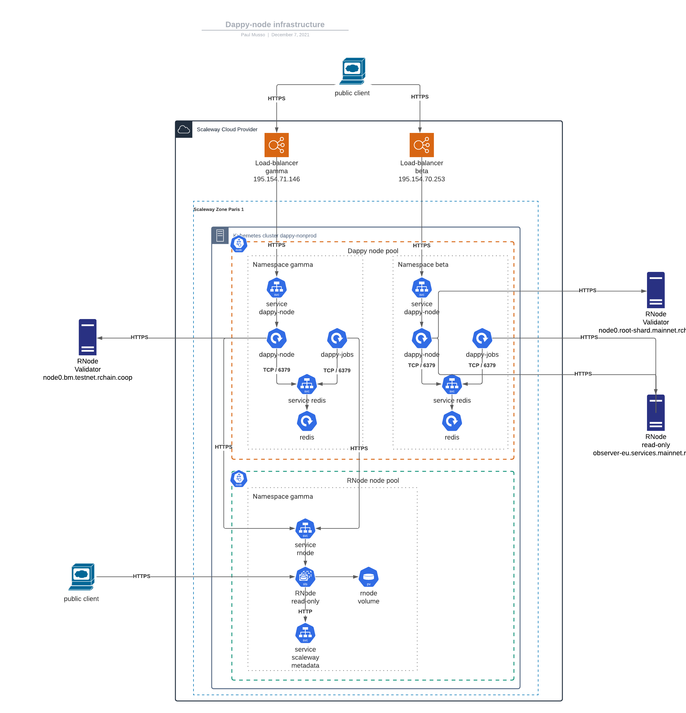

# Dappy node

This repository includes the necessary softwares and tools to run a validator node of dappy. Dappy is a no-DNS name system and web platform that uses blockchain and a co-resolution system instead of the centralized services of the DNS.

The main component of this repository is the nodeJS application `src` and the kubernetes manifests.

To run dappy-node locally, please refer to the [developer documentation](/DEVELOPER.MD).

### helloworld.dappy IP application (dev)

Deploy your zone using [dappy-cli](https://github.com/fabcotech/dappy-cli)

Run web server over TLS using the following script

```sh
node src/helloworld
```

You can load `helloworld.dappy:3005` in dappy browser.

### Production with kubernetes (gamma, beta or d network)

#### General architecture

The common/base kubernetes settings are in `kubernetes/base/`, those are the general settings that do not change, whatever the dappy network or RChain network is. The base settings can be overwritten by those in `kubernetes/envs` that are namespace-specific and context-specific.

The specific configurations files are organized on a per-namespace basis, in the `kubernetes/envs/<CLOUD_PROVIDER>/` folder. We warmly invite you to duplicate this folder and create for example `kubernetes/envs/aws/` folder.

`kubernetes/envs/<CLOUD_PROVIDER>/` contains one folder per namespace. (see commands)

You may handle one, two or more dappy-node namespaces with this repository. An example:
- namespace 1 : **gamma**, connected to RChain testnet. Configuration files in `kubernetes/envs/<CLOUD_PROVIDER>/gamma`
- namespace 2 : **beta**, connected to RChain mainnet. Configuration files in `kubernetes/envs/<CLOUD_PROVIDER>/beta`
- namespace 3 : **d**, connected to RChain mainnet. Configuration files in `kubernetes/envs/<CLOUD_PROVIDER>/d` (main dappy name system not deployed yet)

Non production dappy-node infrastructure



#### Cloud specific setting

The dappy-node endpoint does not need exposition to the DNS, but rnode endpoint must be publicly avaiable and have a domain name. To be executed, `rnode` needs to know its public domain (argument `--host`).  In scaleway we can recover the public domain name of the kubernetes nodes/virtual machines with a wget command, and store the value in `/var/lib/config/public-domain` text file.

You will have to change this so that it works with your cloud provider.

See `kubernetes/envs/<CLOUD_PROVIDER>/<NAMESPACE>/rnode/rnode-statefulset.yaml`.

#### Namespace

```sh
kubectl get namespace
# switch to gamma namespace
kubectl config set-context --current --namespace=gamma
# switch to beta namespace
kubectl config set-context --current --namespace=beta
```

#### Certificate generation (dappy-node <-> rnode)

RNode needs to be exposed to the public internet, each rnode will have its own subdomain. When it starts, each rnode instance will generate a TLS certificate and key, so we don't have to generate the public TLS certificate and key for the blockchain network.

Nevertheless we need to generate a key pair for the dappy-node <-> rnode communication to be secure. `RNODE_PUBLIC_DOMAIN_NAME` is the public URL of your cluster or server.

```sh
openssl req \
  -x509 \
  -newkey rsa:2048 \
  -sha256 \
  -days 3000 \
  -nodes \
  -keyout rnode.key \
  -out rnode.crt \
  -outform PEM \
  -subj '/CN=rnode' \
  -extensions san \
  -config <( \
    echo '[req]'; \
    echo 'distinguished_name=req'; \
    echo '[san]'; \
    echo 'subjectAltName=DNS.1:localhost,DNS.2:rnode,DNS.3:<RNODE_PUBLIC_DOMAIN_NAME>')
kubectl create secret tls rnode-tls --key="rnode.key" --cert="rnode.crt" -n=<NAMESPACE>
kubectl apply -k kubernetes/envs/<CLOUD_PROVIDER>/<NAMESPACE>/rnode
```

#### Certificate generation (dappy-browser/internet <-> dappy-node)

Dappy is a no-DNS, encrypted only name system. We need to generate a certificate and key for secure browser to node communication. `DAPPY_NETWORK` may be `gamma`, `beta`, `d` or `local` for development.

```sh
openssl req \
  -x509 \
  -newkey rsa:2048 \
  -sha256 \
  -days 3000 \
  -nodes \
  -keyout dappy-node.key \
  -out dappy-node.crt \
  -outform PEM \
  -subj '/CN=<DAPPY_NETWORK>'\
  -extensions san \
  -config <( \
    echo '[req]'; \
    echo 'distinguished_name=req'; \
    echo '[san]'; \
    echo 'subjectAltName=DNS.1:localhost,DNS.2:dappynode,DNS.3:<DAPPY_NODE_PUBLIC_DOMAIN_NAME>')

# save as a secret
kubectl create secret tls dappy-node-tls --key="dappy-node.key" --cert="dappy-node.crt" -n=<NAMESPACE>
kubectl apply -k kubernetes/envs/scaleway/<NAMESPACE>/dappy
```

#### Static IP

A dappy node needs one static IP, get it from your cloud provider and reference it in `kubernetes/envs/scaleway/<NAMESPACE>/dappy/dappy-node-service.yaml .loadBalancerIP`. A fixed IP address matters for the (dappy-browser/internet <-> dappy-node) communication because it is a no-DNS communication.

#### RChain network / rnode configuration

Example file `kubernetes/envs/scaleway/gamma/rnode/rnode-statefulset.yaml`.

Three settings are critical to run a rnode instance, and have it joining a RChain network.
- `BOOTSTRAP` is the bootstrap node that you will first connect to. Please ask RChain dev team for a bootstrap node for a given network.
- `RCHAIN_NETWORK` is the id of the RChain network that you must know prior to connecting, ex: "testbm202107". -
- `SHARD_NAME` is the shard name ex: "testbm". -

#### Dappy node configuration

Example file `kubernetes/envs/scaleway/gamma/dappy/dappy-node-deployment.yaml`.

- `RCHAIN_NAMES_MASTER_REGISTRY_URI` : A dappy node must be connected to a name system, therefore it must know a registry URI (blockchain address) of a rchain token master deployment. You can run dappy-node without this env. (dappy network with no name system).
- `DAPPY_NETWORK` may be `gamma`, `beta`, `d` or `local` for development.
- `READ_ONLY` (url) should point to the local url of rnode service in the k8s cluster, leave it as `https://rnode`.
- `VALIDATOR` (url) should be a public url for a validator node of the same RChain network.
- `RCHAIN_NETWORK` same as above.
- `SHARD_NAME` same as above.


#### Dappy jobs configuration

Example file `kubernetes/envs/scaleway/gamma/dappy/dappy-jobs-deployment.yaml`.

Dappy jobs are cron jobs, the main one stores log of some rchain token contracts.
- `RCHAIN_NAMES_MASTER_REGISTRY_URI` same as above.
- `RCHAIN_NAMES_LOGS_CONTRACTS` comma-separated list of contracts you want to keep the logs of. example `dappynamesystem,dappytoken`.


##### Redeploy rnode on scaleway

The idea is to drop existing rnode statefulset and their persistent volume and recreate them.

```sh
cd kubernetes/envs/<CLOUD_PROVIDER>/<NAMESPACE>

# Delete existing rnode stafulset and associated pvc and pv
kubectl delete statefulsets.apps rnode --wait
# Wait until statefulset pods rnodes are deleted, use `kubectl get pods` to know if rnode pods are fully deleted

# Delete rnode pvc by executing `kubectl get pvc` and `kubectl delete pvc <RNODE_PVC_NAME>`
#For example, on Scaleway only, to drop pvc used by rnode-0, execute folloowing command
kubectl delete pvc csi-vol-scw-rnode-0

# Redeploy rnode
kubectl apply -k ./kubernetes/envs/<CLOUD_PROVIDER>/gamma/rnode
```